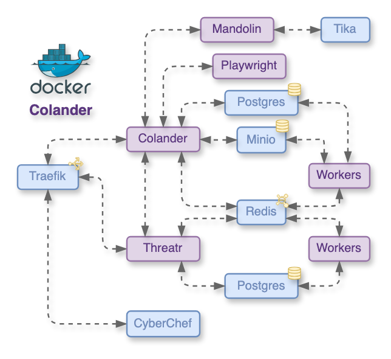

<!-- _class: lead -->
<!-- _paginate: false -->

# PTS setup and configuration

## Module 1 of 4

Defensive Lab Agency | pts-project.org

---

# Who we are

Defensive Lab Agency (DLA) is a French digital security organization working with journalists, lawyers, HRDs and NGOs.

DLA builds and maintains the **PiRogue Tool Suite (PTS)**, a free and open-source mobile forensics and digital investigation platform, used by civil society organizations facing targeted surveillance.

- 🔗 defensive-lab.agency
- 🔗 pts-project.org
- 🔗 github.com/PiRogueToolSuite

---

# Rules of the game

No fancy slides.
We progress at your pace.
Raise your hand at any time.
Tell us when we are going too fast.
Ask as many questions as you want.
We will be asking you questions too!

We're going to tackle some complex subjects, so it's okay to make mistakes or not to know.

---

# Main objective

By the end of this session, each organization will have a working PTS environment:

- a **virtual PiRogue** deployed and running
- a **Colander** instance deployed on a dedicated server
- **users and teams** configured in Colander
- PiRogues **enrolled** into Colander, ready for the next modules

Everything we set up today will be used in modules 2 to 4.

---

# Agenda

1. The PiRogue Tool Suite in one picture
2. The case we will follow across the four modules
3. Deploying a virtual PiRogue
4. PiRogue Admin Web
5. Deploying Colander on a dedicated server
6. Configuring Colander users and teams
7. Connecting the PiRogue - Colander ecosystem

---

<!-- _class: case -->

# The case we will follow: LAB-001

A journalist working with one of your organizations reports:

- battery drains fast, the phone is warm even when idle
- unusual mobile data consumption
- a few weeks ago, an SMS said their **Wire** account would be suspended, with a link to install a "secure update"
- they installed it; since then, the phone "acts strange"

Module 1: build the environment. Module 2: capture the phone's traffic. Module 3: find the app, analyze it, share. Module 4: watch the app run with Octopus.

For the training, the "journalist's phone" is a **wiped test device** carrying a **known malware sample** and a **simulated C2**. Never train on a real victim's device.

---

# The PiRogue Tool Suite in one picture

**PiRogue**: a device (physical or virtual) that intercepts and analyzes the network traffic of mobile devices.

**Colander**: a web-based case management, digital investigation and knowledge-building platform. It is where evidence lives.

**Standalone services** working with Colander:
- **Threatr**: threat intelligence aggregation (VirusTotal, Shodan, OTX, MISP...)
- **Mandolin**: offline artifact analysis (ClamAV antivirus, Yara, Apache Tika)
- **Playwright**: web page capture

---

# How the pieces talk to each other


Physical PiRogues, virtual PiRogues acting as VPN servers, and appliances all feed into Colander. Standalone services enrich what Colander stores.

---

# Three operating modes, one software stack

| | Access point | Appliance | VPN |
|---|---|---|---|
| Typical hardware | Raspberry Pi | Computer with 2 Ethernet ports | VM or rented server |
| Device connection | joins the PiRogue's Wi-Fi | plugged behind the PiRogue | WireGuard app + QR code |
| Typical use | in-office analysis | in-office, wired networks | remote analysis, at-risk individuals |

The mode is **chosen automatically** at install time from the network interfaces: a 2nd Wi-Fi card → access point, a 2nd Ethernet port → appliance, a single interface → VPN.

All three run Suricata, NFStream, Grafana and the same admin tooling, and all enroll into Colander.

---

# Deploying a virtual PiRogue: requirements

- a fresh **Debian 12** machine, `amd64` or `arm64`, dedicated to this role
- at least **4 GB RAM and 40 GB disk**
- a **DNS record** pointing to its public IP, ports **80 and 443** reachable (TLS for the dashboard and admin)
- the WireGuard UDP port open in your firewall
- SSH access for the initial installation only

Hosting: Hetzner and Scaleway are known to work, **Digital Ocean is not compatible**.

After setup, day-to-day operations happen in the browser.

---

# Deploying a virtual PiRogue: installation

```bash
sudo apt-get update && sudo apt-get dist-upgrade
sudo apt-get install wget
sudo wget -O /etc/apt/sources.list.d/pirogue.list https://pts-project.org/debian-12/pirogue.list
sudo wget -O /etc/apt/trusted.gpg.d/pirogue.gpg   https://pts-project.org/debian-12/pirogue.gpg
sudo apt-get update && sudo apt-get install pirogue-base
```

Answer **Yes** when asked whether non-superusers may capture traffic. Then:

```bash
pirogue-admin-client system get-configuration        # check SYSTEM_OPERATING_MODE
pirogue-admin-client external-network enable-public-access \
    --domain pirogue.example.org --email you@example.org
```

---

# The keys to your PiRogue

Two secrets are generated at install time:

```bash
pirogue-admin-client dashboard get-configuration      # dashboard password, user admin
pirogue-admin-client access get-administration-token  # full-control admin token
```

The **administration token** is the key to your PiRogue. Store it in your password manager, never in a shared document, never in a chat.

For everyone else, we will create **user accesses** with limited permissions.

---

<!-- _class: demo -->

# Live demo

## Deploying and starting a virtual PiRogue

<!--
Demo script:
- show the fresh Debian 12 VM, run the install block above
- show SYSTEM_OPERATING_MODE = VPN (single interface)
- enable public access with the training domain
- retrieve the admin token, explain safe storage
- open https://<domain>/dashboard to prove the PiRogue is alive
- keep this VM: it becomes the VPN PiRogue used in module 3
-->

---

# PiRogue Admin Web

Managing a PiRogue **no longer requires the command line**.

- served next to the dashboard, at `https://<your PiRogue>/admin`
- requires `pirogue-base` ≥ 2.0.0 and `pirogue-admin-client` ≥ 2.0.8
- log in with a token:
  - the **administration token**: every feature
  - a **user access token**: only the features its permissions allow

The menu adapts to the token: an analyst sees what they need, not the whole system.

If a section says *"the current pirogue-admin version does not support this feature"*: `sudo apt update && sudo apt dist-upgrade`.

---

# What you can do from Admin Web

| Information | Configuration |
|---|---|
| **Status** of the services | **System**: hostname, time zone, dashboard password |
| **Configuration** (read-only) | **Network**: public access, Wi-Fi, open ports |
| **Packages** and versions | **Access**: user accesses and permissions |
| **Network**: connected devices, open ports | **VPN**: WireGuard peers, with QR codes |
| | **Suricata**: enable or add rule sources |

The same component is embedded in Colander for fleet management, so what you learn here applies there too.

---

# User accesses: least privilege

- the owner creates a **user access**: it has its own token and **no permission by default**
- permissions are granted per feature, named `Service:Permission`, e.g. `System:GetStatus`, `Network:ListVPNPeers`, `Network:AddVPNPeer`
- a token can be **regenerated** (revoking the old one) or the access deleted, at any time, without touching the admin token

One PiRogue can safely serve several analysts. The administration token never leaves the owner's hands.

---

<!-- _class: demo -->

# Live demo

## A tour of PiRogue Admin Web

<!--
Demo script:
- log in at /admin with the administration token
- walk through Status, Packages, Network, Suricata
- Access: create one user access live, grant System:GetStatus and the
  VPN peer permissions; it is used later to enroll this PiRogue in Colander
- log out, log back in with the user token: show the reduced menu
-->

---

# Deploying Colander: the stack

Colander runs as a Docker stack on a dedicated server.



---

# What each component does

- **Traefik**: reverse proxy, obtains TLS certificates (Let's Encrypt) automatically
- **Postgres**: databases for Colander and Threatr
- **Elasticsearch**: search and indexing
- **Minio**: object storage for evidence and artifacts
- **Redis** and **workers**: background processing (analysis, imports, exports)
- **Threatr**: threat intelligence backend
- **Mandolin + Tika**: automatic artifact analysis (ClamAV verdicts in Colander: upcoming)
- **Playwright**: web page capture
- **CyberChef**: data transformation toolbox

Threatr, Mandolin, Playwright and CyberChef are optional: you choose what you deploy.

---

# Colander server requirements

- a **dedicated** server, latest Debian, public IP address
- at least **4 cores, 4 GB RAM, 500 GB storage**
- DNS records for each sub-domain: `colander.`, `traefik.`, and `threatr.` / `cyberchef.` if deployed
- an SMTP account, so Colander can send invitations and notifications

Evidence grows fast: multi-day PCAPs reach several GB each. Monitor disk usage from day one.

---

# Two ways to deploy

**Ansible playbooks** (recommended for production): run from your laptop, they install Docker (rootless), generate the configuration, deploy the stack, and install backup/restore scripts.

```bash
git clone https://github.com/PiRogueToolSuite/colander-ansible.git
ansible-playbook -K -i production.yml playbooks/install-docker.yml
ansible-playbook    -i production.yml playbooks/generate-configuration.yml
ansible-playbook -J -i production.yml playbooks/colander.yml
```

**Docker Compose standalone** (`colander-ansible/docker/`): lighter, good for a lab. No server hardening, backups or upgrades: those are on you.

---

# Colander configuration: the vault

`generate-configuration` creates `group_vars/colander/vault`. Most secrets are randomly generated; you fill in:

- the **root domain**, and the **Let's Encrypt email**
- the **admin name and email** (crash reports)
- the **SMTP settings**: host, user, password, port, TLS/SSL

Then encrypt it: `ansible-vault encrypt group_vars/colander/vault`, and put the vault password in your password manager.

⚠️ **Never modify the vault after deployment.** Backups only restore with the configuration that created them.

---

# Backups: plan them today

A backup script is installed on the server. It dumps the Colander and Threatr databases, the Elasticsearch indices, and all files stored in Minio.

```bash
ansible-playbook -J -i production.yml playbooks/backup-colander.yml
```

- backups land in `/home/colander/colander/backups/<date>/`
- **you** schedule them and copy them off the server
- a backup is only valid with **its own vault**: keep both together
- Colander updates itself, but **not** the server OS: patch Debian yourself

---

<!-- _class: demo -->

# Live demo

## Colander up and running

<!--
Demo script:
- show the inventory file and the generated vault (secrets masked)
- run the colander playbook, watch the services come up
- first login over HTTPS with the admin account
- point out Traefik doing TLS automatically
- connect Colander to Threatr: Threatr admin > Users + Tokens,
  then Colander admin > Backend Credentials, identifier "threatr"
  (admin panels are at the random URLs set in the vault)
-->

---

# Configuring Colander users

Colander is multi-tenant. Access is structured in three layers:

- **Users**: individual accounts, each person gets their own
- **Teams**: the only way to share cases with other users
- **Cases**: investigations, owned by a user and shared with teams

Practical rules:

- never share accounts, ever
- every user enables **2FA** (TOTP) from their profile
- offboard people by **deactivating** their account, not by changing a shared password

---

# Teams and sharing, in practice

- users **cannot search** for each other by name: to add someone to a team, ask for their **Contributor ID** (in their profile)
- only the **team owner** can edit or delete a team
- only the **case owner** can share a case with a team they belong to
- one case per investigation, shared with the relevant team only

This is by design: one Colander can host people from several organizations without exposing who uses it.

---

# A structure for several organizations

A setup that works when several organizations collaborate:

- each organization runs **its own Colander**
- inside each Colander: one team per working group, for example `Analysts` and `Intake`
- joint investigations get their own case, shared with the relevant team
- cross-organization sharing happens through **case archives and feeds** (module 3), not through shared accounts

Data stays under each organization's control at all times.

---

<!-- _class: demo -->

# Live demo

## Creating users, teams, and the case LAB-001

<!--
Demo script:
- create two users, enable 2FA on one to show the flow
- create the team "Analysts", add the second user by Contributor ID
- create the case "LAB-001 - Journalist device" with a short
  description of the intake report from the scenario slide
- share the case with the team
- this case is reused in modules 2 and 3
-->

---

# Connecting PiRogue and Colander

This is where the ecosystem comes together. Each organization enrolls its PiRogues, physical and virtual, into Colander's **PiRogue fleet**.

What enrollment gives you:

- **fleet view**: all your PiRogues in one place, with their operating mode
- **status monitoring**: `UP` / `DOWN`, checked every hour, 3 days of history
- **remote configuration**: the Admin Web interface, embedded in Colander
- **device monitoring**: flows and Suricata alerts of a device sent into a case (modules 2 and 3)

---

# How enrollment works

1. On the PiRogue, create a **user access** with the permissions Colander needs
2. In Colander, **PiRogue fleet** → fill in the enrollment form:

| Field | What to enter |
|---|---|
| Host / Port | domain or IP of the PiRogue, port `50051` by default |
| Token | the user access token (not the admin token) |
| Public visibility | checked if the PiRogue has a valid public certificate |
| Certificate | otherwise, its self-signed certificate: `pirogue-admin-client access get-administration-certificate` |

3. Colander contacts the PiRogue and shows its status

---

# Sharing a PiRogue with your teams

In the PiRogue's **Access** section inside Colander:

1. create a user access (no permission by default)
2. grant only what the team needs, e.g. VPN peers and device monitoring
3. pick the **Colander teams** allowed to use it

Team members then see the PiRogue in their fleet and can use it for their investigations, with those permissions and nothing more. Remove the team or delete the access to revoke.

Only the person who enrolled a PiRogue can delete it.

---

<!-- _class: demo -->

# Live demo

## Enrolling our PiRogue and checking the fleet

<!--
Demo script:
- enroll the virtual PiRogue deployed earlier, with the user access
  token created in the Admin Web demo
- show it in the fleet: UP, operating mode VPN
- open its details: the embedded admin interface
- Access section: share it with the Analysts team
- log in as the second user: the PiRogue is visible in their fleet
-->

---

<!-- _class: question -->

# Question

A colleague asks you for the PiRogue's administration token "just to check something quickly".

What do you do instead?

<!--
Expected answer: create a user access with only the permission they
need (e.g. System:GetStatus), give them that token or share the PiRogue
with their Colander team, and delete the access when done.
-->

---

# Troubleshooting: the usual suspects

- **PiRogue not reachable**: firewall, then `SYSTEM_OPERATING_MODE`
- **no TLS certificate**: DNS records, and ports 80/443 reaching the server
- **enrollment fails**: Colander must reach the PiRogue on port `50051`; check the token and, without public visibility, the certificate
- **missing sections in Admin Web**: upgrade the PiRogue
- **no data in a case**: the PiRogue must reach Colander, and the token must allow device monitoring
- **no emails**: check the SMTP settings in the vault

And when stuck: the community Discord is active, bring your logs (`journalctl` on the Colander server).

---

# End-of-session checklist

Before we close, each organization should have:

- [ ] a virtual PiRogue running, dashboard reachable over HTTPS
- [ ] access to PiRogue Admin Web, admin token stored safely
- [ ] Colander reachable over HTTPS on its own domain, vault encrypted and backed up
- [ ] Colander connected to Threatr
- [ ] user accounts created, 2FA enabled
- [ ] the team `Analysts` and the case `LAB-001`
- [ ] at least one PiRogue enrolled, `UP` in the fleet, shared with the team

---

# Questions & resources

- Documentation: 🔗 docs.pts-project.org
- Guides: 🔗 docs.pts-project.org/guides/overview
- Community Discord: 🔗 discord.gg/qGX73GYNdp
- Source code: 🔗 github.com/PiRogueToolSuite

Next module: **Network interception, capture and analysis**. We will put the journalist's phone on the wire.
