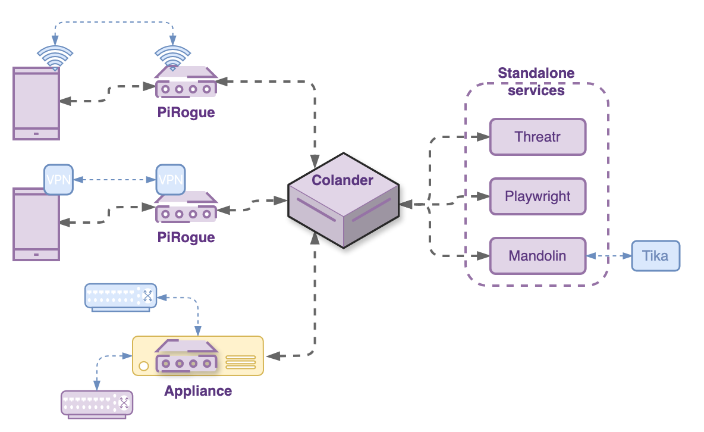

<!-- _class: lead -->
<!-- _paginate: false -->

# PTS ecosystem, Colander, integrations

## Module 3 of 4

3 hours

Defensive Lab Agency | pts-project.org

---

# Main objective

Explore the broader PiRogue Tool Suite ecosystem: remote capture capabilities, data federation with Colander, and integration with other relevant tools and workflows for forensic investigations.

By the end, you should be able to run a full investigation cycle: capture, manage, analyze, enrich, and share, across partner organizations. And we close case LAB-001.

---

<!-- _class: case -->

# Where we left case LAB-001

- traffic captured, beaconing to `sync.update-wire.<lab domain>` identified
- flow imported, observables documented in the case with TLP/PAP

Open questions for today:

- what is the implant on the device? Which app carries it?
- what does the artifact itself tell us?
- who else should know, and how do we tell them safely?

---

# Agenda

1. The ecosystem in one picture (10 min)
2. PiRogue VPN for remote capture (25 min)
3. Case management and evidence in Colander (25 min)
4. Data federation: PiRogue ↔ Colander (15 min)
5. MVT integration for spyware detection (25 min)
6. Mandolin: automatic artifact analysis (20 min)
7. Exporting and sharing: feeds, MISP, STIX 2.1 (25 min)
8. Operational workflows, exercise, wrap-up (35 min)

---

# The ecosystem in one picture



Physical PiRogues, virtual PiRogues as VPN servers, and appliances all federate into Colander. Threatr, Mandolin and Playwright work as standalone services around it.

---

# PiRogue VPN: the problem it solves

An at-risk individual suspects their phone is compromised.

They are in another city, another country. They will never have physical access to your PiRogue, and asking them to travel may put them at risk.

**PiRogue VPN** turns a virtual PiRogue into an emergency VPN server: their traffic reaches your analysis pipeline through an encrypted tunnel, wherever they are.

Our journalist could have been onboarded this way on day one.

---

# PiRogue VPN: how it works

1. your organization runs a virtual PiRogue in **VPN mode**, enrolled in Colander
2. in the case, create the **device**, then a **device monitoring**: PiRogue, duration (1 to 14 days)
3. click **Create** on the VPN Peer row: Colander creates a WireGuard peer and sets the IP filter to it
4. the person installs the **WireGuard app** and **scans the QR code**, that's all they do
5. start the monitoring: flows and alerts arrive in the case
6. at the end, the monitoring stops by itself; **Release** the peer

No technical skills required on their side.

---

# PiRogue VPN: things to get right

- **consent**: informed, explicit, documented. You will see all their traffic, they must understand that.
- **scope and duration**: agree on how long the monitoring runs, set that duration, release the peer when done
- **capacity**: one virtual PiRogue can serve several monitored devices; watch bandwidth
- **their safety**: a VPN app on the device may itself be noticed. Assess the threat model first.
- **data handling**: captured traffic is sensitive personal data. Access on need-to-know basis only.

---

<!-- _class: demo -->

# Live demo, part 1

## Enrolling the journalist's phone remotely

<!--
Demo script (live threat example, continued):
- in case LAB-001, create a new device monitoring on the virtual
  PiRogue from module 1, duration 1 day
- create the VPN peer, show the QR code, scan it with the test
  device's WireGuard app, start the monitoring
- traffic starts flowing: show the same beaconing pattern from
  module 2 now arriving through the VPN path
- point: same detection pipeline, zero physical access
-->

---

# Colander: case management

Everything in Colander lives inside a **case**:

- **Observables**: domains, IPs, URLs, hashes
- **Artifacts**: files, PCAPs, screenshots, dumps
- **Devices**: the phones and equipment under investigation
- **Actors**: the entities involved
- **Threats**: the malware families or campaigns identified
- **Events**: what happened and when
- **Detection rules**: Yara, Suricata... written from your findings
- **Data fragments**: text extracts, code, payloads

Entities are typed, linked by **relations**, and visualized as a graph.

---

# Colander: evidence storage and collaboration

- every uploaded artifact gets its **MD5, SHA1 and SHA256** computed, and a **detached signature** made with the case's private key: anyone receiving it can verify it with `openssl`
- every entity carries a **TLP** and a **PAP**
- every case is scoped to its **owner and teams**: need-to-know access
- the graph view helps you see connections a table hides: the SMS link, the app, the C2 domain and the beaconing flow all relate to the same threat

This structure is how several organizations work a joint investigation without merging their infrastructures.

---

# Data federation: PiRogue ↔ Colander

What federation means in practice, tying together everything since module 1:

- enrolled PiRogues are **checked every hour**, with 3 days of status history
- a **device monitoring** streams flows and Suricata alerts into a case (Mongoose), for 1 to 14 days
- the **IP filter** keeps only the monitored device's traffic
- **configuration changes** are made from Colander, without physical access
- access is governed by **user accesses tied to Colander teams**: least privilege by design

One analyst in one office can operate PiRogues deployed across several organizations.

---

<!-- _class: demo -->

# Live demo, part 2

## The case so far: entities, graph, evidence

<!--
Demo script:
- open case LAB-001
- review the entities created in module 2
- build the graph live: link device -> flow -> C2 domain -> threat
- upload the module 2 PCAP as an artifact, show the hashes and
  the signature, compare with the sha256sum noted in module 2
-->

---

# MVT: Mobile Verification Toolkit

MVT, developed by Amnesty International's Security Lab, is the reference open-source tool for **consensual forensic analysis** of Android and iOS devices. Its license **forbids** use on non-consenting people's devices.

- checks device data against **published IOCs** of known spyware campaigns (Pegasus, Predator...), or **your own** IOCs
- pre-installed on the PiRogue, but maintained by Amnesty, not by PTS
- on Android, MVT **no longer analyzes the phone over ADB**: acquire with **AndroidQF** first, then analyze the acquisition

The acquisition is evidence: hash it, store it in the case, analyze copies. It can be re-analyzed later when new IOCs are published.

---

# Android: acquire, then analyze

```bash
androidqf                         # on your laptop, phone plugged in, USB debugging on
                                  # Backup: "Only SMS"  ·  Download: "Only non-system packages"
mvt-android download-iocs         # latest public IOCs
mvt-android check-androidqf --iocs lab-001.stix2 -o results/ <acquisition>
```

AndroidQF collects: SMS, installed packages and their APKs, processes, settings, logs, file listings.

MVT flags: IOC matches (domains in SMS, package names, hashes), and apps that did **not** come from an official store.

<!--
AndroidQF binaries: github.com/mvt-project/androidqf/releases.
lab-001.stix2 is generated by the lab kit. Check docs.mvt.re before
each delivery: MVT evolves fast.
-->

---

# MVT + PiRogue: a two-angle detection

| Angle | Tool | What it sees |
|---|---|---|
| On-device | AndroidQF + MVT | traces left on the device: SMS, installed apps, processes, files |
| On-network | PiRogue | live communications: C2 servers, beaconing, exfiltration |

Sophisticated spyware hides on the device. It cannot hide its network traffic forever.

For our case: the network gave us the C2. MVT now gives us the app, and the SMS that delivered it.

---

<!-- _class: demo -->

# Live demo, part 3

## Finding the implant with AndroidQF and MVT

<!--
Demo script (live threat example, continued):
- run androidqf against the test device (Only SMS / Only non-system packages)
- hash the acquisition, upload it to case LAB-001
- mvt-android check-androidqf --iocs lab-001.stix2 on it
- walk through the detections: the lure SMS (domain IOC), the package
  com.wire (app:id IOC), installed outside the Play Store
- the fake Wire APK from the acquisition becomes our artifact
-->

---

<!-- _class: case -->

# Is it really Wire?

| | Genuine Wire | What we found |
|---|---|---|
| Package name | `com.wire` | `com.wire` (same!) |
| Signing certificate | Wire Swiss GmbH | **O=Zeta**, SHA256 `e14f2546…4ec929` |
| Extra code | | **`org.xmlpush.v3`**: 241 obfuscated classes |
| Permissions | messaging needs | + read/send **SMS**, **call log**, **microphone**, **location**, contacts, calendar, start at boot |

A package name can be copied. **A signing certificate cannot.** Always compare it with the genuine app.

APK SHA256: `ae05bbd31820c566543addbb0ddc7b19b05be3c098d0f7aa658ab83d6f6cd5c8`

<!--
Show it in jadx (APK signature, AndroidManifest.xml) or in the Pithus
report. Guide: docs.pts-project.org/guides/handle-a-malicious-app
The strings of org.xmlpush.v3 are encrypted: static analysis does not
reveal the C2. That is the cliffhanger for module 4.
-->

---

# Mandolin: automatic artifact analysis

Every artifact uploaded to Colander is hashed, signed, then analyzed **offline** by Mandolin:

- **Apache Tika**: text and metadata extraction from 1000+ file types, GPS location of photos on a map
- **thumbnails** for pictures

Mandolin also runs **ClamAV** and your **Yara** rules through its REST API; the antivirus verdict inside Colander is upcoming.

Offline matters: no third-party service sees your evidence, no upload of a victim's data to a commercial sandbox. Case confidentiality is preserved.

---

<!-- _class: demo -->

# Live demo, part 4

## The APK and the acquisition in the case

<!--
Demo script (live threat example, continued):
- upload the fake Wire APK and the AndroidQF acquisition to case LAB-001
- show hashes, signature and the Tika metadata in the artifact details
- create the observables: APK SHA256, signing cert SHA256, com.wire,
  update-wire.<lab domain>; create the threat "Fake Wire (LAB-001)"
- link the artifact to the C2 observables in the graph:
  the picture is now network + device + artifact
- optional: scan the APK with Mandolin's REST API (ClamAV + Yara)
-->

---

<!-- _class: case -->

# Case LAB-001: the picture so far

| Question | Answer | Source |
|---|---|---|
| Is the device compromised? | Yes | beaconing + alert + MVT |
| What is the implant? | fake Wire `com.wire`, signed O=Zeta | AndroidQF + MVT, jadx |
| Where does it talk? | `sync.update-wire.<lab domain>`:8443 | PiRogue capture |
| Since when? | correlated with the SMS link date | timeline in the case |
| Evidence integrity? | PCAP, acquisition, APK hashed and signed | Colander artifacts |

Still open: **what does the injected code do when it runs?** (module 4). And: telling the people who need to know.

---

# Sharing: why interoperability matters

Your findings are more valuable when other defenders can use them: the same campaign rarely targets one person.

PTS speaks the standard languages of threat intelligence:

- **MISP** format
- **STIX 2.1**
- **CSV**, JSON, Graphviz (dot), Mermaid

Conversion is handled by the `colander-data-converter` library, built to minimize information loss between formats. No lock-in: your data moves freely between Colander, MISP, OpenCTI and other tools.

---

# Case archives: moving a whole case

- **Archives** menu of a case → **Generate a new one**: a ZIP with a manifest, every entity, relation and artifact file
- the owner gets an email when it is ready; only case contributors can download it
- to import: **New case** → *import an archive*: the manifest is checked, the content previewed, then imported
- imported entities get **new IDs**, and the importer becomes the **owner**

This is how a case moves between two organizations' Colanders.

---

# Knowledge feeds: sharing what you learned

- a **feed** exposes a case's knowledge at a URL protected by a **secret** (`?secret=` or the `X-Colander-Feed` header)
- formats: JSON, STIX2, MISP, CSV, dot, Mermaid (MISP needs your org name and UUID)
- choose the entity types, and a **maximum TLP**: anything above it is not shared
- feeds **never** contain artifact files or the case's private key
- **template feeds** (Jinja, sandboxed) produce custom formats, but ⚠️ they **do not filter by TLP**

**Knowledge import**: Colander also imports MISP events, STIX 2.1 bundles and CSV files into a case.

---

# Threatr: enrichment on demand

Threatr aggregates threat intelligence from VirusTotal, OTX AlienVault, Shodan, Scarlet Shark, MISP and more, behind **a single API and a single data model**.

- query it directly from any flow or observable in Colander
- it **caches** what it learned about an IoC, and can be forced to refresh from all sources
- self-hostable, and **you choose the sources** and the API keys: relevant when queries themselves are sensitive (remember PAP)

Check the C2 domain of a new case against it first: maybe a partner already met it.

---

<!-- _class: demo -->

# Live demo, part 5

## Sharing the findings with a partner

<!--
Demo script (live threat example, finale):
- export case LAB-001 as an archive
- import it into a second Colander instance (another organization),
  show the manifest check, the preview, the new owner
- create a STIX 2.1 / MISP feed of the case's observables, max TLP:AMBER,
  show the feed URL and its secret
- close the loop: this is how the second organization would detect the
  same C2 on their own PiRogues tomorrow
-->

---

# Operational workflow for an investigation team

1. **Intake**: open a case in Colander, document the context and consent
2. **Capture**: connect the device (access point or VPN), create a device monitoring
3. **Triage**: dashboard, Suricata alerts, flow risk, DPI anomalies
4. **Collect**: import flows, upload artifacts, AndroidQF + MVT
5. **Enrich**: Mandolin results, Threatr lookups (within the PAP)
6. **Document**: observables, threats, events, relations, the graph, TLP/PAP
7. **Share**: case archive to a partner, feed to the community

We just did all seven steps on one case, across three modules.

---

# Working across organizations

Several organizations, one shared capability:

- each organization runs its own PiRogues and its own Colander
- shared investigations travel as **case archives**
- common IOCs circulate as **feeds** in MISP or STIX 2.1 format, filtered by TLP
- PiRogue VPN extends coverage to people none of you can physically reach
- Threatr gives every analyst the same enrichment, from sources you chose

The tooling is shared. The data stays under each organization's control.

---

# Exercise

As a team:

1. create a device monitoring with a VPN peer in a fresh case, connect a device
2. capture, triage one alert, import the flow
3. upload one artifact and check Mandolin's results
4. query Threatr on one observable, if its PAP allows it
5. export the case archive and hand it to another team
6. the receiving team imports it and verifies the content

30 minutes. The receiving team reports what they found, using only the archive.

---

# Wrap-up: what you now operate

- virtual and physical PiRogues, managed from the browser
- a fleet federated into Colander: status, remote configuration, device monitoring
- remote capture for people at risk, via VPN and a QR code
- automatic artifact analysis, offline, evidence never leaves your servers
- AndroidQF + MVT for on-device spyware detection, network + device angles combined
- standards-based sharing between organizations and beyond, governed by TLP

And one case ready to share. Next module: **dynamic analysis with Octopus**, to see what the fake Wire actually does.

---

# Questions & resources

- Documentation: 🔗 docs.pts-project.org
- Guides: 🔗 docs.pts-project.org/guides/overview
- Community Discord: 🔗 discord.gg/qGX73GYNdp
- Monthly community meeting: last Friday of each month, 2pm CET
- Support the project: 🔗 opencollective.com/pts

Thank you!
